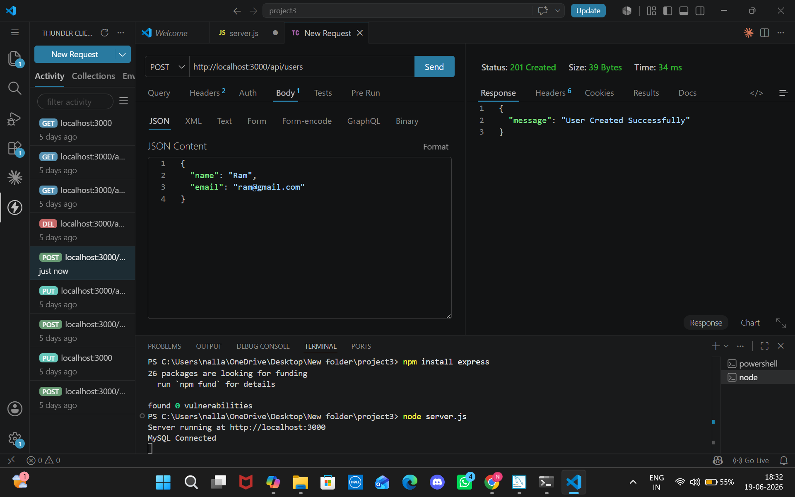
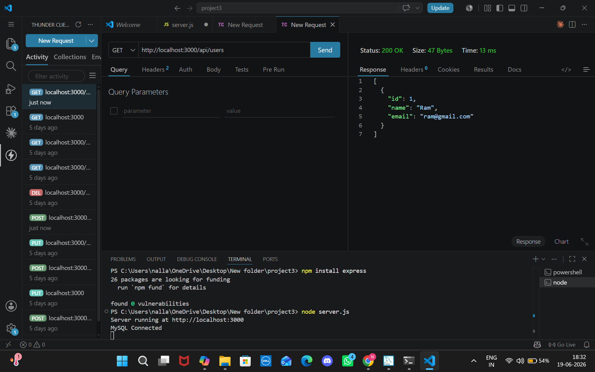
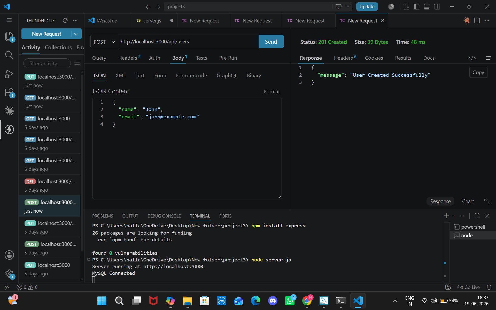
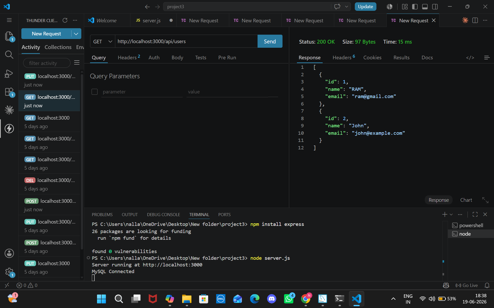
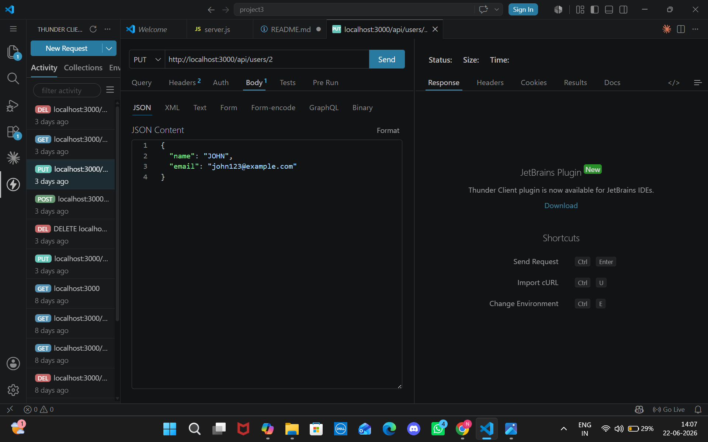
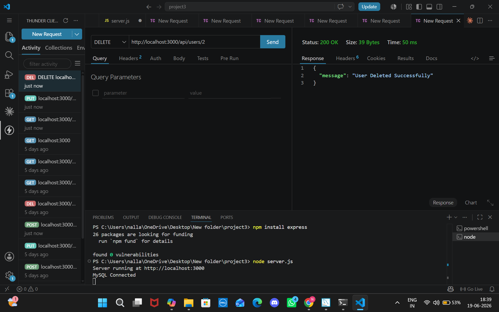

# Project 3: Database Integration

## Overview
This project demonstrates Database Integration using Node.js, Express.js, and MySQL. The application provides RESTful APIs to perform CRUD (Create, Read, Update, Delete) operations on user data stored in a MySQL database.

## Technologies Used
* Node.js
* Express.js
* MySQL
* MySQL2 Package
* Thunder Client (API testing)
* Visual Studio Code

## 📂 Project Structure
project3/
├── node_modules/       # Dependencies
├── package.json        # Project metadata & scripts
├── package-lock.json   # Dependency lock file
├── server.js           # Entry point with all routes
├── /images             # MySQL & Thunder Client screenshots
└── README.md           # Project documentation

## ⚙️ Setup Instructions
1. Clone the repository:
   git clone https://github.com/neha5x3/Task-3-NallaNeha.git
2. Navigate to the project folder:
    cd Task-3-NallaNeha
3. Install dependencies:
    npm install
4. Ensure MySQL is running and the database is created:
    CREATE DATABASE studentdb;
    USE studentdb;
    CREATE TABLE users (
        id INT AUTO_INCREMENT PRIMARY KEY,
        name VARCHAR(100) NOT NULL,
        email VARCHAR(100) NOT NULL
    );
5. Start the server:
    node server.js
6. Test endpoints using Thunder Client (VS Code extension):
    GET http://localhost:3000/api/users → Retrieve all users
    POST http://localhost:3000/api/users → Create new user
    PUT http://localhost:3000/api/users/:id → Update user
    DELETE http://localhost:3000/api/users/:id → Delete user

## Database Schema

**Database Name:** `studentdb`  
**Table Name:** `users`

| Column | Data Type    | Constraints                 |
| ------ | ------------ | --------------------------- |
| id     | INT          | Primary Key, Auto Increment |
| name   | VARCHAR(100) | NOT NULL                    |
| email  | VARCHAR(100) | NOT NULL                    |

## API Endpoints

### Home Route
GET /
Returns a message indicating that the server is running.

### Get All Users
GET /api/users
Retrieves all users from the database.

### Create User
POST /api/users
Adds a new user to the database.

Sample Request:

{
"name": "John",
"email": "john@gmail.com"
}

### Update User

PUT /api/users/:id
Updates an existing user's information.

Sample Request:

{
"name": "JOHN",
"email": "john123@gmail.com"
}

### Delete User

DELETE /api/users/:id

Removes a user from the database.

## Features

* Database Connectivity using MySQL
* REST API Development
* CRUD Operations
* Data Validation
* JSON Request and Response Handling
* Persistent Data Storage

📸 Screenshots
MySQL Database Setup

1. CREATE DATABASE
    (images/createdatabase.png)

2. Select * from user1
    (images/1usercreate(s).png)

3. Select * from user2
    (images/2usercreate(s).png)

4. Update user2
    (images/put2user(s).png)

5. delete user2 from studentdb
    (images/deleteuser2(s).png)

Thunder Client Testing

1. POST Create User1 (Success)
    

2. GET Users (Available)
    

3. POST Create Another User
    

4. Get All Users
    

5. PUT Update User
    

6. DELETE User By ID
    

## Testing
Verified all endpoints with Thunder Client
Checked error handling for invalid requests
Confirmed proper status codes (200, 201, 400, 404)
Validated persistent data storage in MySQL

📜 License
MIT License

👨‍💻 Author
Name: Nalla Neha
Education: B.Tech CSE (DecodeLabs Internship Project 3)
GitHub: https://github.com/neha5x3